# Crurated ERP — Entity-Relationship Diagram

> Visualizza su [mermaid.live](https://mermaid.live) o in qualsiasi editor che supporti Mermaid (VS Code, GitHub, etc.)

## Diagramma completo per modulo

```mermaid
erDiagram

    %% ═══════════════════════════════════════
    %% INFRASTRUCTURE
    %% ═══════════════════════════════════════

    users {
        bigint id PK
        string name
        string email UK
        string password
        timestamp email_verified_at
    }

    audit_logs {
        uuid id PK
        string auditable_type
        uuid auditable_id
        string event
        json old_values
        json new_values
        bigint user_id FK
    }

    users ||--o{ audit_logs : "esegue"

    %% ═══════════════════════════════════════
    %% MODULE 0 — PIM (Product Information)
    %% ═══════════════════════════════════════

    countries {
        uuid id PK
        string name
        string code UK
    }

    regions {
        uuid id PK
        uuid country_id FK
        string name
    }

    appellations {
        uuid id PK
        uuid region_id FK
        string name
    }

    producers {
        uuid id PK
        uuid country_id FK
        string name
        string website
    }

    countries ||--o{ regions : "contiene"
    countries ||--o{ producers : "sede"
    regions ||--o{ appellations : "contiene"

    wine_masters {
        uuid id PK
        string name
        string producer
        string appellation
        string country
        string region
        string liv_ex_code
        json regulatory_attributes
    }

    wine_variants {
        uuid id PK
        uuid wine_master_id FK
        int vintage_year
        decimal alcohol_percentage
        json critic_scores
        enum lifecycle_status
        string lwin_code
    }

    formats {
        uuid id PK
        string name
        int volume_ml
        bool is_standard
    }

    case_configurations {
        uuid id PK
        uuid format_id FK
        string name
        int bottles_per_case
        enum case_type
        bool is_breakable
    }

    sellable_skus {
        uuid id PK
        uuid wine_variant_id FK
        uuid format_id FK
        uuid case_configuration_id FK
        string sku_code UK
        string barcode
        enum lifecycle_status
    }

    liquid_products {
        uuid id PK
        uuid wine_variant_id FK
        json allowed_equivalent_units
        json allowed_final_formats
        enum lifecycle_status
    }

    attribute_sets {
        uuid id PK
        string name
        bool is_default
    }

    attribute_groups {
        uuid id PK
        uuid attribute_set_id FK
        string name
        int sort_order
    }

    attribute_definitions {
        uuid id PK
        uuid attribute_group_id FK
        string code
        string name
        string input_type
    }

    attribute_values {
        uuid id PK
        uuid wine_variant_id FK
        uuid attribute_definition_id FK
        string value
        enum source
    }

    product_media {
        uuid id PK
        uuid wine_variant_id FK
        enum type
        string url
        bool is_primary
    }

    wine_masters ||--o{ wine_variants : "ha vintages"
    wine_variants ||--o{ sellable_skus : "ha SKUs"
    wine_variants ||--o| liquid_products : "produce liquido"
    wine_variants ||--o{ attribute_values : "ha attributi"
    wine_variants ||--o{ product_media : "ha media"
    formats ||--o{ case_configurations : "usato in"
    formats ||--o{ sellable_skus : "formato"
    case_configurations ||--o{ sellable_skus : "configurazione"
    attribute_sets ||--o{ attribute_groups : "contiene"
    attribute_groups ||--o{ attribute_definitions : "contiene"
    attribute_definitions ||--o{ attribute_values : "definisce"

    %% ═══════════════════════════════════════
    %% MODULE K — CUSTOMERS
    %% ═══════════════════════════════════════

    parties {
        uuid id PK
        string legal_name
        enum party_type
        string tax_id
        string vat_number
        string jurisdiction
        enum status
    }

    party_roles {
        uuid id PK
        uuid party_id FK
        enum role
    }

    customers {
        uuid id PK
        uuid party_id FK
        string name
        string email UK
        string stripe_customer_id
        enum customer_type
        enum status
    }

    accounts {
        uuid id PK
        uuid customer_id FK
        string name
        enum channel_scope
        enum status
    }

    addresses {
        uuid id PK
        string addressable_type
        uuid addressable_id
        string street
        string city
        string country
        enum type
        bool is_default
    }

    payment_permissions {
        uuid id PK
        uuid customer_id FK
        bool card_payment_allowed
        bool bank_transfer_allowed
        decimal credit_limit
    }

    memberships {
        uuid id PK
        uuid customer_id FK
        enum tier
        enum status
        date effective_from
        date effective_to
    }

    clubs {
        uuid id PK
        string name
        enum club_type
        int active_member_limit
        enum status
    }

    customer_clubs {
        uuid id PK
        uuid customer_id FK
        uuid club_id FK
        enum affiliation_status
    }

    operational_blocks {
        uuid id PK
        string blockable_type
        uuid blockable_id
        enum block_type
        string reason
        enum status
    }

    parties ||--o{ party_roles : "ha ruoli"
    parties ||--o{ customers : "e' anche"
    customers ||--o{ accounts : "possiede"
    customers ||--o{ payment_permissions : "ha permessi"
    customers ||--o{ memberships : "membership"
    customers ||--o{ customer_clubs : "iscritto a"
    clubs ||--o{ customer_clubs : "membri"

    %% ═══════════════════════════════════════
    %% MODULE A — ALLOCATIONS
    %% ═══════════════════════════════════════

    allocations {
        uuid id PK
        uuid wine_variant_id FK
        uuid format_id FK
        enum source_type
        enum supply_form
        int total_quantity
        int sold_quantity
        enum status
    }

    vouchers {
        uuid id PK
        uuid customer_id FK
        uuid allocation_id FK
        uuid wine_variant_id FK
        uuid format_id FK
        uuid sellable_sku_id FK
        uuid case_entitlement_id FK
        int quantity
        enum lifecycle_state
        bool tradable
    }

    case_entitlements {
        uuid id PK
        uuid customer_id FK
        uuid sellable_sku_id FK
        enum status
        timestamp broken_at
    }

    voucher_transfers {
        uuid id PK
        uuid voucher_id FK
        uuid from_customer_id FK
        uuid to_customer_id FK
        enum transfer_type
        enum status
    }

    wine_variants ||--o{ allocations : "allocato"
    formats ||--o{ allocations : "formato"
    allocations ||--o{ vouchers : "genera"
    customers ||--o{ vouchers : "possiede"
    sellable_skus ||--o{ vouchers : "riferimento"
    customers ||--o{ case_entitlements : "ha casse"
    sellable_skus ||--o{ case_entitlements : "SKU"
    case_entitlements ||--o{ vouchers : "parte di cassa"
    vouchers ||--o{ voucher_transfers : "trasferito"

    %% ═══════════════════════════════════════
    %% MODULE D — PROCUREMENT
    %% ═══════════════════════════════════════

    procurement_intents {
        uuid id PK
        string product_reference_type
        uuid product_reference_id
        int quantity
        enum trigger_type
        enum sourcing_model
        enum status
    }

    purchase_orders {
        uuid id PK
        uuid procurement_intent_id FK
        uuid supplier_party_id FK
        string product_reference_type
        uuid product_reference_id
        int quantity
        decimal unit_cost
        string currency
        enum status
    }

    inbounds {
        uuid id PK
        uuid procurement_intent_id FK
        uuid purchase_order_id FK
        string product_reference_type
        uuid product_reference_id
        string warehouse
        int quantity
        enum packaging
        enum status
    }

    bottling_instructions {
        uuid id PK
        uuid liquid_product_id FK
        json format_requirements
        json serialization_specs
    }

    procurement_intents ||--o{ purchase_orders : "eseguito da"
    parties ||--o{ purchase_orders : "fornitore"
    purchase_orders ||--o{ inbounds : "ricevuto in"
    procurement_intents ||--o{ inbounds : "collegato a"
    liquid_products ||--o{ bottling_instructions : "istruzioni"

    %% ═══════════════════════════════════════
    %% MODULE B — INVENTORY
    %% ═══════════════════════════════════════

    locations {
        uuid id PK
        string name UK
        enum location_type
        string country
        bool serialization_authorized
        enum status
    }

    serialized_bottles {
        uuid id PK
        uuid wine_variant_id FK
        uuid format_id FK
        uuid allocation_id FK
        uuid inbound_batch_id FK
        uuid current_location_id FK
        uuid case_id FK
        string serial_number UK
        enum ownership_type
        enum state
    }

    cases {
        uuid id PK
        uuid case_configuration_id FK
        uuid allocation_id FK
        uuid inbound_batch_id FK
        uuid current_location_id FK
        enum integrity_status
    }

    inventory_movements {
        uuid id PK
        uuid source_location_id FK
        uuid destination_location_id FK
        uuid executed_by FK
        enum movement_type
        enum trigger
        bool custody_changed
        timestamp executed_at
    }

    movement_items {
        uuid id PK
        uuid inventory_movement_id FK
        uuid serialized_bottle_id FK
    }

    allocations ||--o{ serialized_bottles : "serializzato"
    allocations ||--o{ cases : "in casse"
    locations ||--o{ serialized_bottles : "posizione"
    locations ||--o{ cases : "posizione"
    cases ||--o{ serialized_bottles : "contiene"
    case_configurations ||--o{ cases : "config"
    locations ||--o{ inventory_movements : "origine"
    locations ||--o{ inventory_movements : "destinazione"
    inventory_movements ||--o{ movement_items : "items"
    serialized_bottles ||--o{ movement_items : "movimentato"

    %% ═══════════════════════════════════════
    %% MODULE C — FULFILLMENT
    %% ═══════════════════════════════════════

    shipping_orders {
        uuid id PK
        uuid customer_id FK
        uuid source_warehouse_id FK
        enum status
        enum packaging_preference
        string carrier
        date requested_ship_date
    }

    shipping_order_lines {
        uuid id PK
        uuid shipping_order_id FK
        uuid voucher_id FK
    }

    shipments {
        uuid id PK
        uuid shipping_order_id FK
        string carrier
        string tracking_number
        enum status
        json shipped_bottle_serials
        timestamp shipped_at
    }

    shipping_order_exceptions {
        uuid id PK
        uuid shipping_order_id FK
        enum exception_type
        string description
    }

    customers ||--o{ shipping_orders : "ordina spedizione"
    locations ||--o{ shipping_orders : "magazzino origine"
    shipping_orders ||--o{ shipping_order_lines : "righe"
    vouchers ||--o{ shipping_order_lines : "voucher in spedizione"
    shipping_orders ||--o{ shipments : "spedizioni"
    shipping_orders ||--o{ shipping_order_exceptions : "eccezioni"

    %% ═══════════════════════════════════════
    %% MODULE E — FINANCE
    %% ═══════════════════════════════════════

    invoices {
        uuid id PK
        uuid customer_id FK
        string source_type
        uuid source_id
        string invoice_number UK
        enum invoice_type
        string currency
        decimal subtotal
        decimal tax_amount
        decimal total_amount
        decimal amount_paid
        enum status
        date due_date
    }

    invoice_lines {
        bigint id PK
        uuid invoice_id FK
        uuid sellable_sku_id FK
        string description
        int quantity
        decimal unit_price
        decimal tax_rate
        decimal line_total
    }

    payments {
        uuid id PK
        uuid customer_id FK
        string payment_reference UK
        enum source
        decimal amount
        string currency
        enum status
        enum reconciliation_status
        string stripe_payment_intent_id UK
    }

    invoice_payments {
        uuid id PK
        uuid invoice_id FK
        uuid payment_id FK
        decimal amount_applied
        timestamp applied_at
    }

    credit_notes {
        uuid id PK
        uuid original_invoice_id FK
        uuid customer_id FK
        string credit_note_number
        decimal amount
        enum status
    }

    customer_credits {
        uuid id PK
        uuid customer_id FK
        enum credit_type
        decimal amount
        decimal remaining_amount
        enum status
    }

    subscriptions {
        uuid id PK
        uuid customer_id FK
        enum subscription_type
        string plan
        enum status
        bool auto_renew
    }

    storage_billing_periods {
        uuid id PK
        uuid customer_id FK
        date period_start
        date period_end
        decimal amount
    }

    customers ||--o{ invoices : "fatturato a"
    invoices ||--o{ invoice_lines : "righe"
    sellable_skus ||--o{ invoice_lines : "prodotto"
    customers ||--o{ payments : "paga"
    invoices ||--o{ invoice_payments : "pagamenti applicati"
    payments ||--o{ invoice_payments : "applicato a"
    invoices ||--o{ credit_notes : "nota credito"
    customers ||--o{ credit_notes : "crediti"
    customers ||--o{ customer_credits : "crediti cliente"
    customers ||--o{ subscriptions : "abbonamenti"
    customers ||--o{ storage_billing_periods : "storage"

    %% ═══════════════════════════════════════
    %% MODULE S — COMMERCIAL
    %% ═══════════════════════════════════════

    channels {
        uuid id PK
        string name
        enum channel_type
        string default_currency
        json allowed_commercial_models
        enum status
    }

    price_books {
        uuid id PK
        uuid channel_id FK
        string name
        string market
        string currency
        date valid_from
        date valid_to
        enum status
    }

    price_book_entries {
        uuid id PK
        uuid price_book_id FK
        uuid sellable_sku_id FK
        uuid policy_id FK
        decimal base_price
        enum source
    }

    pricing_policies {
        uuid id PK
        string name
        enum policy_type
        enum status
    }

    offers {
        uuid id PK
        string name
        enum offer_type
        enum status
        date valid_from
        date valid_to
    }

    offer_eligibilities {
        uuid id PK
        uuid offer_id FK
        string eligible_type
        uuid eligible_id
    }

    offer_benefits {
        uuid id PK
        uuid offer_id FK
        enum benefit_type
        decimal value
    }

    discount_rules {
        uuid id PK
        string name
        enum discount_type
        decimal discount_value
        enum status
    }

    bundles {
        uuid id PK
        string name
        enum bundle_type
        enum status
    }

    bundle_components {
        uuid id PK
        uuid bundle_id FK
        uuid sellable_sku_id FK
        int quantity
    }

    estimated_market_prices {
        uuid id PK
        uuid sellable_sku_id FK
        decimal price
        string currency
        string source
    }

    channels ||--o{ price_books : "listini"
    price_books ||--o{ price_book_entries : "voci"
    sellable_skus ||--o{ price_book_entries : "prezzato in"
    pricing_policies ||--o{ price_book_entries : "genera"
    offers ||--o{ offer_eligibilities : "eligibilita"
    offers ||--o{ offer_benefits : "benefici"
    bundles ||--o{ bundle_components : "componenti"
    sellable_skus ||--o{ bundle_components : "in bundle"
    sellable_skus ||--o{ estimated_market_prices : "prezzo mercato"
```

## Legenda Moduli

| Colore | Modulo | Descrizione |
|--------|--------|-------------|
| - | **Infrastructure** | Users, Audit Logs |
| 0 | **PIM** | Wine Masters, Variants, SKUs, Formats |
| K | **Customers** | Parties, Customers, Accounts, Clubs |
| A | **Allocations** | Allocations, Vouchers, Case Entitlements |
| D | **Procurement** | Intents, Purchase Orders, Inbounds |
| B | **Inventory** | Locations, Serialized Bottles, Cases, Movements |
| C | **Fulfillment** | Shipping Orders, Shipments |
| E | **Finance** | Invoices, Payments, Credits, Subscriptions |
| S | **Commercial** | Channels, Price Books, Offers, Bundles |

## Relazioni cross-modulo chiave

- **Voucher → Allocation → WineVariant/Format** — lineage immutabile
- **SerializedBottle → Allocation** — binding immutabile
- **ShippingOrder → Customer → Vouchers** — late binding in Module C
- **Invoice → Customer + source polimorfico** — finance come conseguenza
- **PurchaseOrder → ProcurementIntent** — sempre richiesto
- **PriceBookEntry → SellableSku** — ponte PIM ↔ Commercial

## Relazioni polimorfiche

| Tabella | Colonne | Target possibili |
|---------|---------|-----------------|
| `audit_logs` | auditable_type/id | Qualsiasi modello Auditable |
| `addresses` | addressable_type/id | Customer, Account |
| `operational_blocks` | blockable_type/id | Customer, Account |
| `procurement_intents` | product_reference_type/id | SellableSku, LiquidProduct |
| `purchase_orders` | product_reference_type/id | SellableSku, LiquidProduct |
| `inbounds` | product_reference_type/id | SellableSku, LiquidProduct |
| `invoices` | source_type/id | ShippingOrder, Subscription, etc. |
